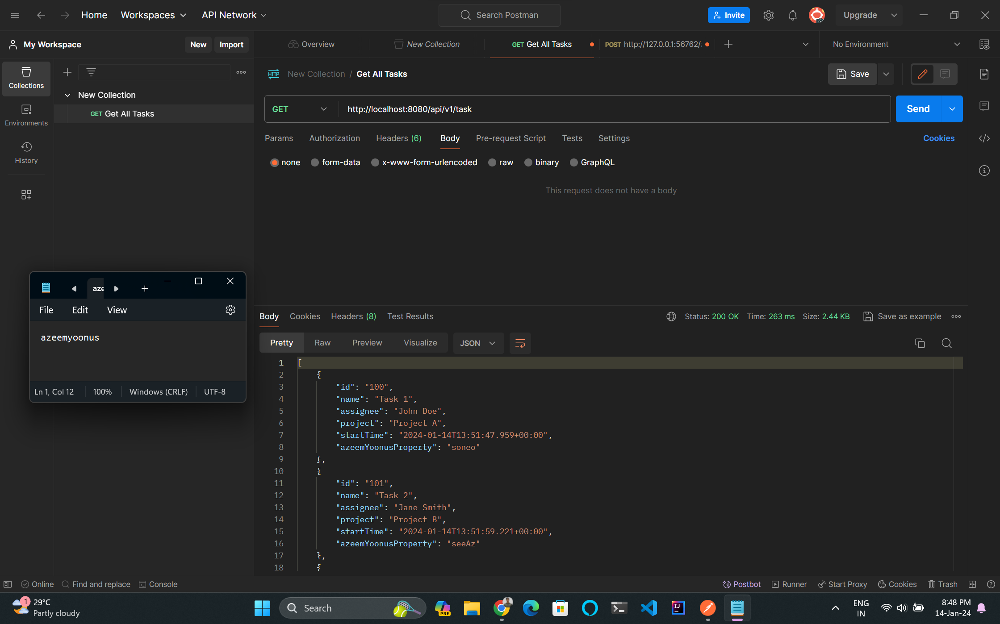
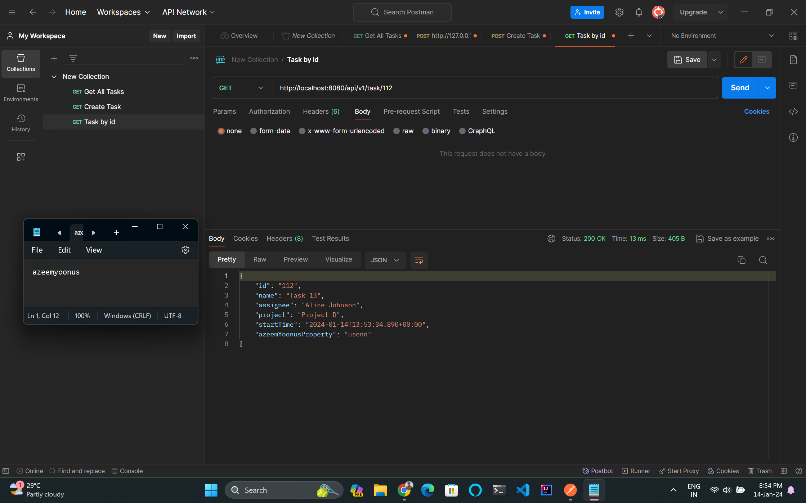
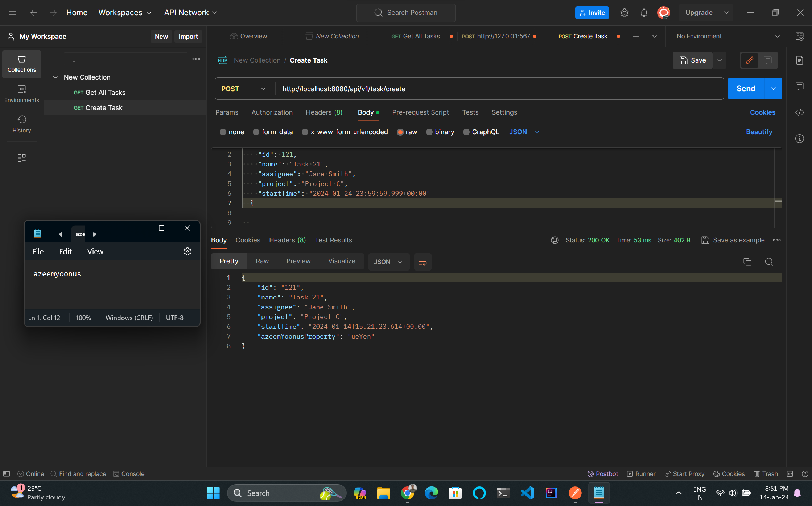
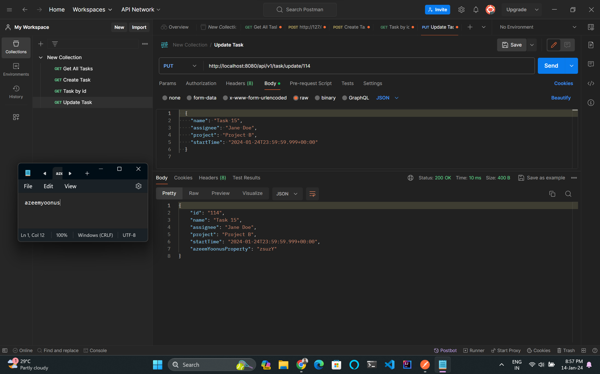
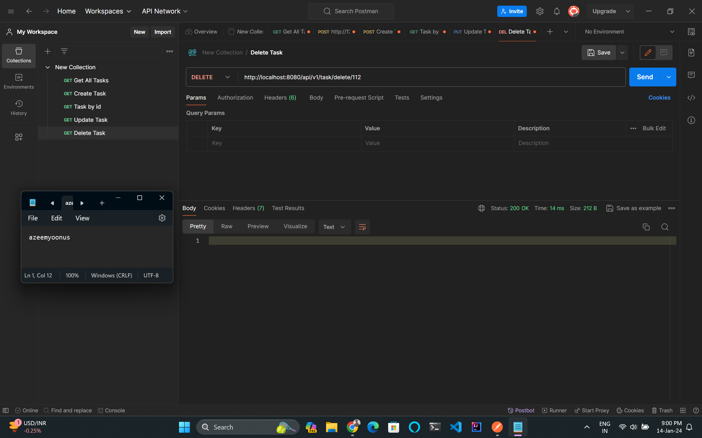
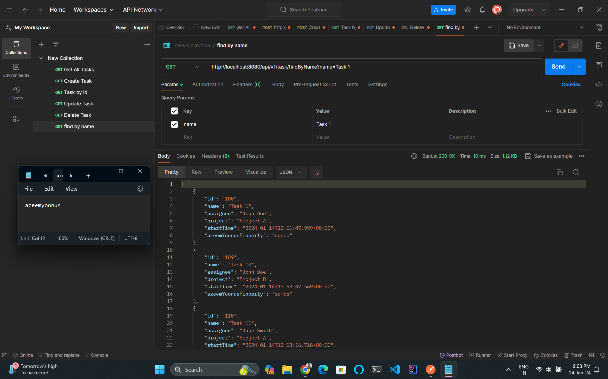
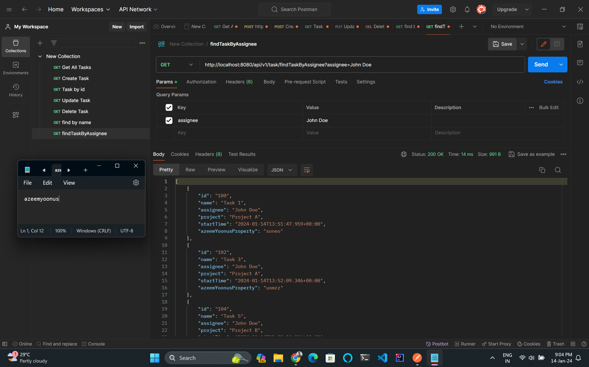

# Task API

## Overview

Task API is a Java application providing a RESTful API for managing tasks. Tasks are stored in a MongoDB database and can be created, retrieved, updated, and deleted using various endpoints.

## Endpoints

### 1. Get All Tasks

#### Endpoint 
```GET /api/v1/tasks```

#### Description
Retrieves all tasks.

#### Screenshot


### 2. Get Task by ID

#### Endpoint
```GET /api/v1/task/{taskId}```

#### Parameters
- `taskId`: The ID of the task to retrieve.

#### Description
Retrieves a task by its unique identifier.

#### Screenshot


### 3. Add Task

#### Endpoint
```
POST /api/v1/task/create
```

#### Request Body
```json
{
  "id": "Task id",
  "name": "Task Name",
  "assignee": "Assignee Name",
  "project": "Project Name",
  "StartTime": "Start Time Local "
}
```
#### Description
Creates a new task.
#### Screenshot



### 4. Update Task
#### Endpoint
```
PUT /api/v1/task/update/{taskId}
```

#### Parameters

- **taskId**: The ID of the task to update.
#### Request Body
```json
{
  "name": "Updated Task Name",
  "assignee": "Updated Assignee Name",
  "project": "Updated Project Name",
  "StartTime": "Updated Start Time Local "
}
```
#### Description
Updates an existing task.
#### Screenshot


### 5. Delete Task
#### Endpoint
```
DELETE /api/v1/task/delete/{taskId}
```
#### Parameters

- **taskId**: The ID of the task to delete.
#### Description
Deletes a task by its ID.
#### Screenshot


### 6. Find Tasks by Name
#### Endpoint
```
GET /api/v1/tasks/findByName?name={taskName}
```
#### Parameters
- **name:** The string to search for in task names
#### Description
Finds tasks by name.
#### Screenshot


### 7. Find Tasks by Assignee (Top 10, Sorted by Start Time)
#### Endpoint
```
GET /api/v1/tasks/findTaskByAssignee?assignee={assigneeName}
```
#### Parameters
- **assignee:** The name of the task assignee
#### Description
Finds the top 10 tasks assigned to a specific assignee, sorted by start time.
#### Screenshot


## Installation
- Clone the repository: git clone https://github.com/azeemyoonus/Kaiburr-Assessment.git
- Navigate to the project directory: cd Task 01. Java REST API
- Build and run the application: ./mvnw spring-boot:run

## Requirements
- Java 8 or higher
- MongoDB

## Contributing
We welcome contributions! Please follow the Contribution Guidelines for details on how to contribute to this project.