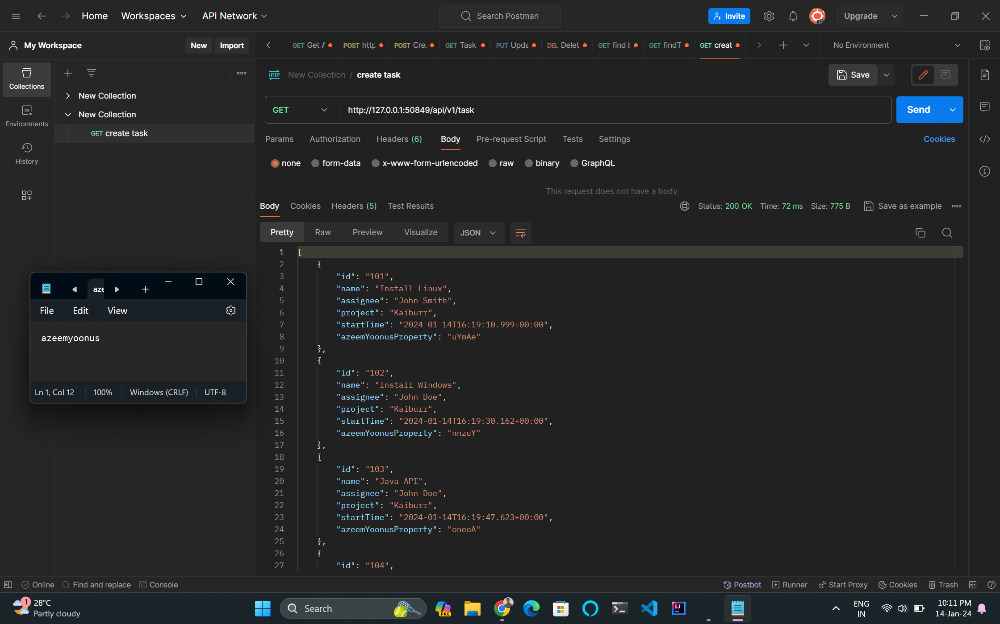
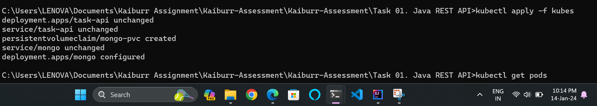
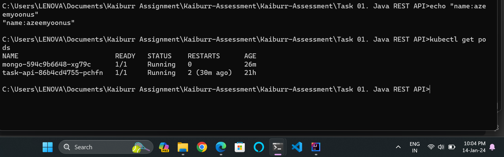
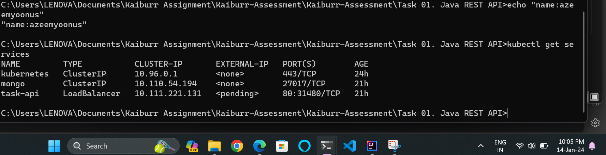
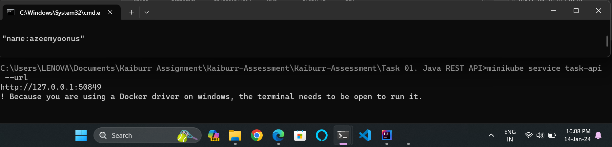
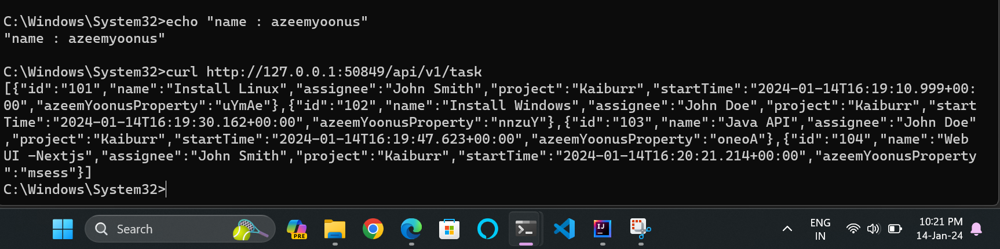

# Task API - Kubernetes Deployment

This repository contains a Java Spring Boot application [Task 01](https://github.com/azeemyoonus/Kaiburr-Assessment/tree/main/Task%2001.%20Java%20REST%20API) with a MongoDB database, deployed on Kubernetes using Minikube.

## Docker Images

### 1. Spring Boot Application

- Docker Hub Repository: [azeemyoonus/task-api](https://hub.docker.com/repository/docker/azeemyoonus/task-api/)
- Image: `azeemyoonust/task-api:latest`

### 2. MongoDB

- Docker Hub Repository: [mongo](https://hub.docker.com/_/mongo)
- Image: `mongo:latest`

## Kubernetes Deployment

### 1. Deploying MongoDB

```bash
kubectl apply -f mongo.yaml
```
### 2.  Deploying the Spring Boot Application
```bash
kubectl apply -f deployment.yaml
```

### 3.  Verify Deployments
```bash
kubectl get pods
```

### 4. Get task-api service url
```bash
minikube service task-api --url
```

### 5. Accessing EndPoint


## Results
###  1, 2  Deploying MongoDB app Deployment
- You can do it by individual mentioned above or by folder

   
### 3. Verify Deployment



### 4. Get url


### 5. Accessing endpoint

