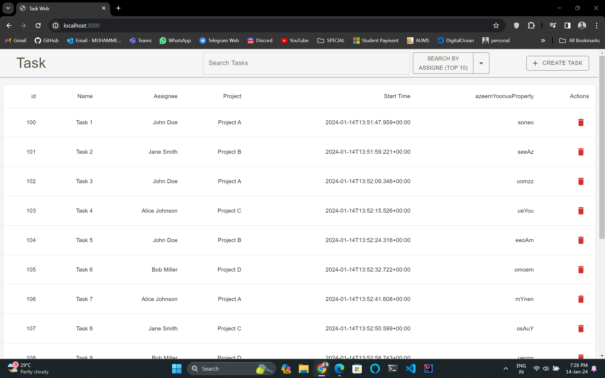
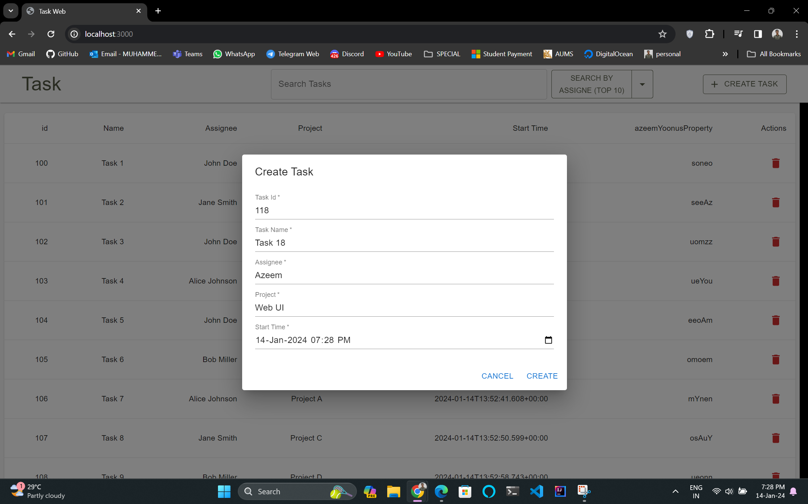
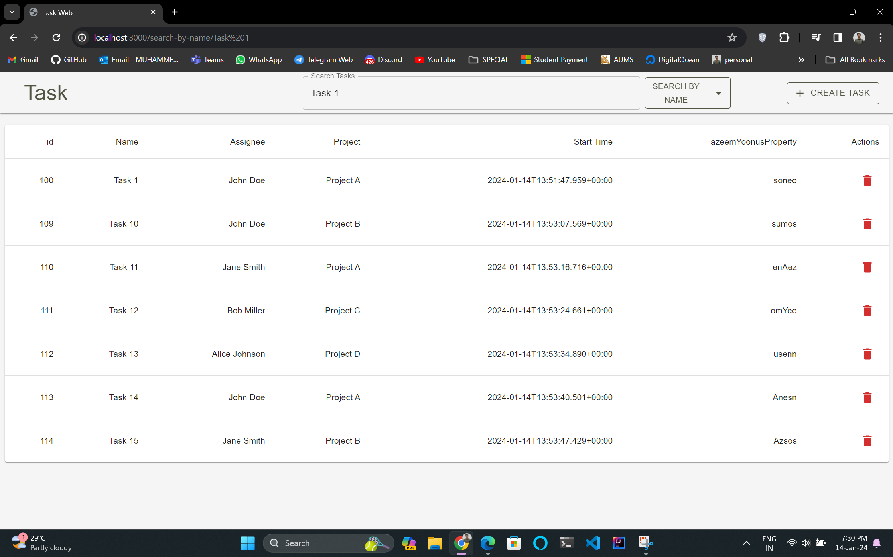
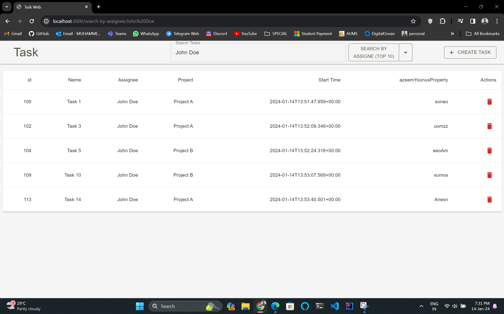
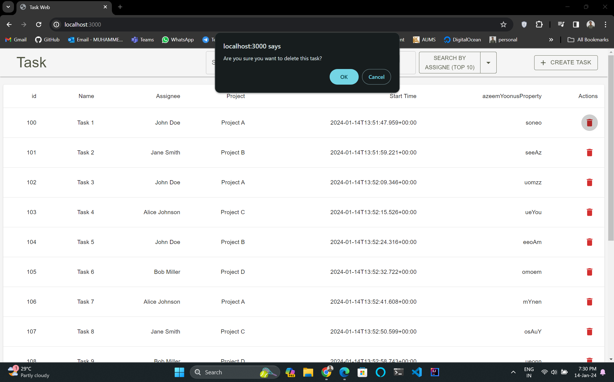

# Task Management App

This is a simple Task Management web application with a backend built using Java Spring Boot and a frontend developed with Next.js and Material-UI. It allows users to perform various tasks such as creating tasks, deleting tasks, and searching for tasks based on different criteria.

## Backend (Java Spring Boot)

The backend of this application is implemented in Java Spring Boot. You can find the backend source code [Task 1](<https://github.com/azeemyoonus/Kaiburr-Assessment>).


## Getting Started

First, run the development server:

```bash
npm run dev
# or
yarn dev
# or
pnpm dev
# or
bun dev
```

Open [http://localhost:3000](http://localhost:3000) with your browser to see the result.


### Features
#### Create Task
Easily create a new task by clicking the "Create Task" button. Fill in the required details, such as Task ID, Name, Assignee, Project, and Start Time. Click "Create" to add the task to the list.

#### Delete Task
Each task in the list has a "Delete" button associated with it. Clicking this button will prompt you to confirm the deletion. Upon confirmation, the task will be deleted, and you'll receive a success message.

#### Search Task
Use the search bar to find tasks based on different criteria:
- **Search by Name:** Select "Search by Name" option, enter the name in the search bar, and click the search button.
- **Search by Assignee (Top 10):** Select "Search by Assignee (Top 10)" option, enter the assignee's name in the search bar, and click the search button.
- **Find All:** Select "Find All" option to retrieve all tasks.

### Results
- Main page


- task create


- search by name


- search by assignee


- task delete



## Contributing

Thank you for considering contributing to this project! Contributions are welcome and appreciated. 

